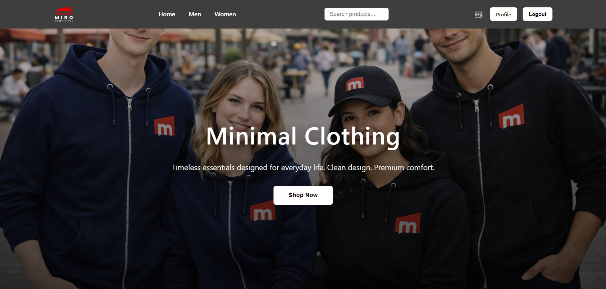
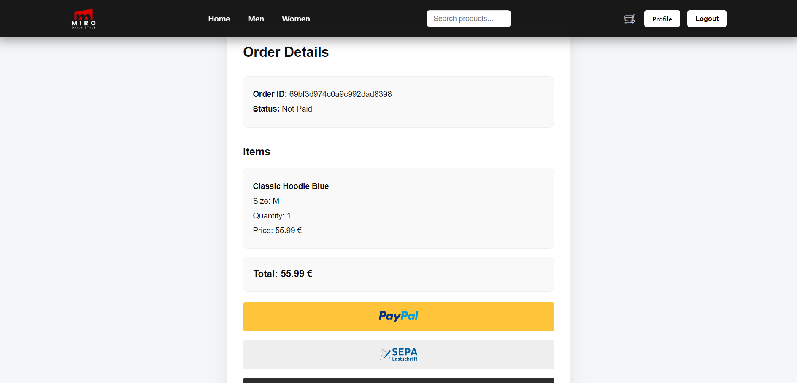
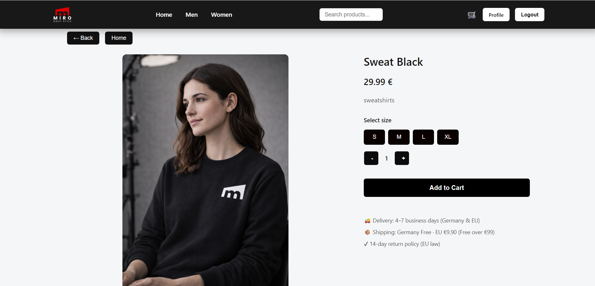
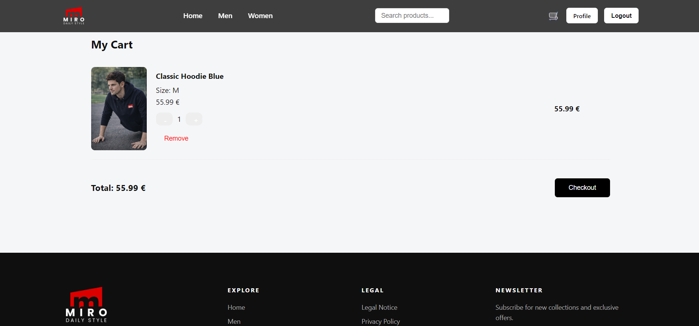
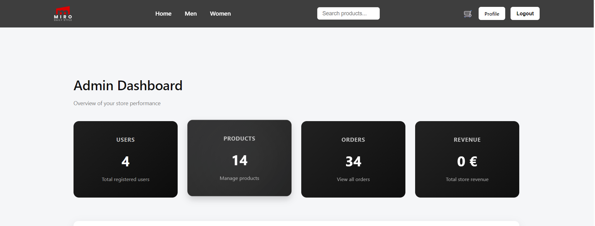
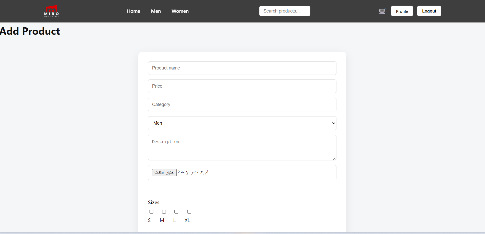
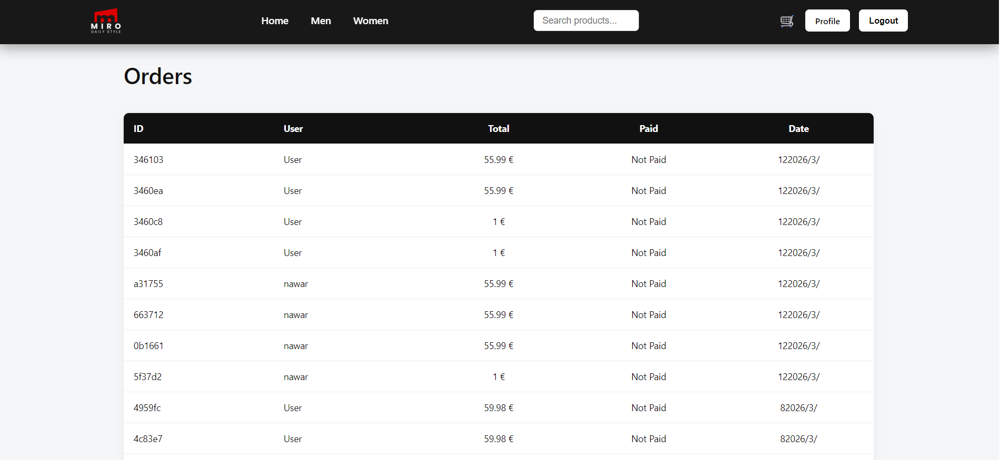
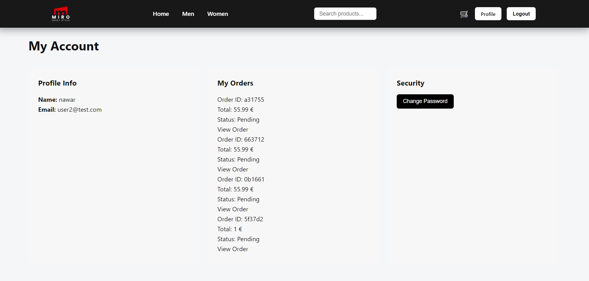

# 🛒 MIRO Store – Full Stack E-commerce Application

A full-stack e-commerce web application built using the MERN stack and containerized with Docker.

This project simulates a modern online clothing store where users can browse products, manage a cart, place orders, and pay using PayPal. It also includes an admin dashboard for managing products and orders.

---

## 🚀 Live Demo

👉 https://

---

## ✨ Key Features

* Secure user authentication using JWT
* Full shopping cart and checkout system
* PayPal payment integration (sandbox)
* Admin dashboard for product and order management
* Product reviews and rating system
* Password reset functionality
* Fully containerized application using Docker

---

## 🧪 Demo Credentials

**Admin Account:**
Email: [user4@test.com]
Password: 123456789

---

## 🛠️ Tech Stack

### Frontend

* React (Vite)
* React Router
* Context API
* CSS

### Backend

* Node.js
* Express.js

### Database

* MongoDB (Mongoose)

### DevOps

* Docker
* Docker Compose

---

## 📸 Screenshots

### 🏠 Home

### 🛍️ Checkout

### 📦 Product Details

### 🛒 Cart

### ⚙️ Admin Dashboard

### ➕ Add Product

### 📊 Orders

### 👤 Account 

---

## ⚙️ Running the Project (Docker)

Make sure Docker is installed, then run:

docker compose up --build

This will start:

* Frontend container
* Backend container
* MongoDB container

After startup, open:

Frontend: http://localhost:5173
Backend API: http://localhost:5000

---

## 🌱 Seeding the Database

If the database is empty, run:

docker exec -it miro_backend node scripts/seed.js

This will insert sample products into MongoDB.

---

## 🔐 Environment Variables

Create a `.env` file inside the backend folder:

MONGO_URI=your_mongodb_connection
JWT_SECRET=your_secret_key
PAYPAL_CLIENT_ID=your_paypal_client_id

---

## 📂 Project Structure

miro_store/

├── backend/
│   ├── controllers/
│   ├── models/
│   ├── routes/
│   ├── middleware/
│   ├── scripts/
│   └── server.js

├── frontend/
│   ├── src/
│   ├── components/
│   ├── pages/
│   └── App.jsx

└── docker-compose.yml

---

## 💡 About This Project

This project demonstrates the development of a real-world full-stack e-commerce system including authentication, payment processing, and admin management.

---

## 👨‍💻 Author

Hussam Abosaleh
GitHub: https://github.com/HussamAbosaleh

